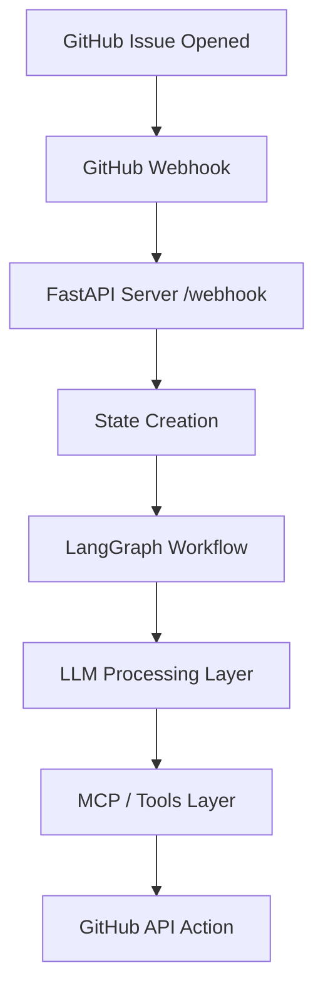

#GitHub Issue Automation System

An AI-powered automation system that listens to GitHub issue events via webhooks and intelligently triages, analyzes, and processes issues using a LangGraph-based workflow.
This system automatically handles newly opened issues and routes them through an LLM-powered workflow for classification, prioritization, and decision-making.

##🏗️ System Architecture


##📂 Project Structure
```text
.
├── app/
│   ├── main.py              # FastAPI entry point
│   │
│   ├── config/              # Configuration management
│   ├── graph/               # LangGraph workflow definitions
│   ├── llm/                 # LLM integration layer
│   ├── mcp/                 # Tool orchestration / MCP layer
│   ├── utils/               # Helper utilities
│   └── __pycache__/
│
├── tests/                   # Unit & integration tests
│
├── Dockerfile               # Container setup
├── requirements.txt         # Dependencies
├── run.sh                   # Startup script
├── .env                     # Environment variables (DO NOT COMMIT)
├── .gitignore
└── README.md

```
##🔄 Webhook Processing Flow
```text
sequenceDiagram
    participant GH as GitHub
    participant API as FastAPI Server
    participant Graph as LangGraph
    participant LLM as LLM Engine
    participant GitHubAPI as GitHub REST API

    GH->>API: Issue Opened Webhook
    API->>API: Validate Action == "opened"
    API->>Graph: Pass Issue State
    Graph->>LLM: Analyze Issue
    LLM-->>Graph: Structured Output
    Graph->>GitHubAPI: (Future) Add Labels / Comment

```


##🧠 Internal Module Interaction

```text
flowchart LR
    main.py --> graph
    graph --> llm
    graph --> mcp
    llm --> utils
    mcp --> utils

```
##⚙️ Running the Project

    ###Local Development
        uvicorn app.main:app --reload

    ###Docker

        docker build -t github-issue-automation .
        docker run -p 8000:8000 github-issue-automation

##🔐 Environment Variables

        Create .env file:

        GROK_API_KEY=your_key  ## You can use any providers api key
        GITHUB_TOKEN=your_token

##🛠️ Setup Instructions

    ###1️⃣ Clone the Repository

        git clone https://github.com/your-username/github-issue-automation.git
        cd github-issue-automation

    ###2️⃣ Create Virtual Environment

        python -m venv myenv
        source myenv/bin/activate   # Mac/Linux
        myenv\Scripts\activate      # Windows

    ###3️⃣ Install Dependencies

        pip install -r requirements.txt

    ###4️⃣ Run the Server

        uvicorn app.main:app --reload --port 8000 ## main webhook api endpoint
        uvicorn app.mcp.server --reload --port 9000 ## api endpoints for labels, comment and assign tools

        ####NOTE: Make sure you install (ngrok) and run in cmd at 8000 port to make webhook endpoint available for github , if you are running it locally.

##Server runs at:

        http://localhost:8000  --> Webhook server endpoint
        http://localhost:9000  --> label, comment , assign tools server endpoint
        

##🔗 GitHub Webhook Configuration

    ###Go to your GitHub repository.

        Settings → Webhooks → Add Webhook

    ###Payload URL:

        https://your-domain.com/webhook

    ###Content Type:

        application/json

    ###Select:

        Issues

Now every new issue will trigger your system.


